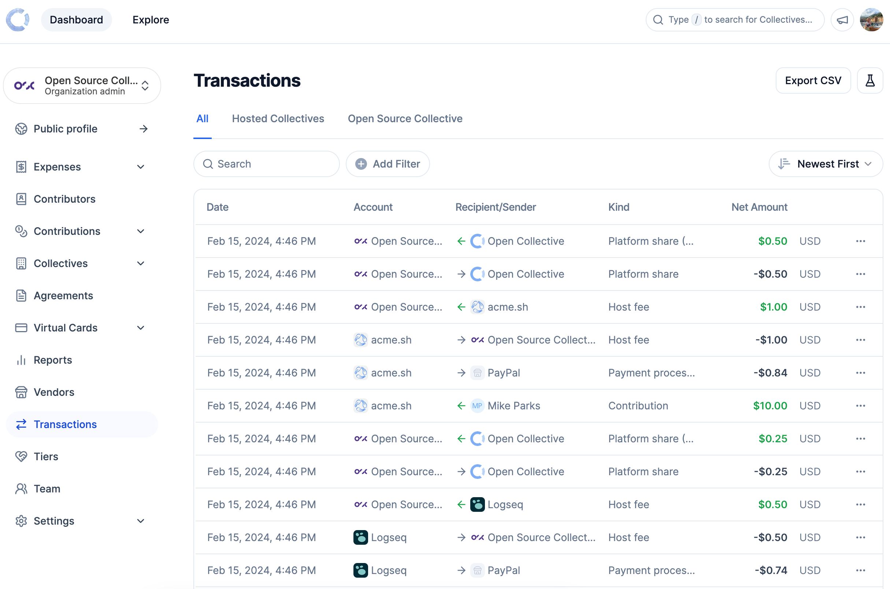

# Viewing Transactions

Browse the Open Collective Ledger with the Dashboard Transactions tool. We have designed it to look and operate similarly to a bank statement.

To view the Transactions page, navigate to your **Dashboard** and then **Transactions**. Utilize the account switcher to switch between accounts.&#x20;

<figure><figcaption></figcaption></figure>

In the transactions table you can see the Date and Time of the transaction, the account, the Recipient/Sender, the Kind of transaction and the Net amount with the Currency.

### **Contextual Transactions**&#x20;

The transactions you see are based on the context in which you are using the tool.

1. If your view is set to your individual account, you will see transactions that are related only to you: expenses you've submitted and contributions you've made.
2. If you are a collective administrator, you will see all the transactions that are related to the collective: all the added funds, contributions made to the collective, expenses submitted to the collective, and payment processor and host fees.
3. If you are a fiscal host administrator, you will see all of your organizational transactions and all the transactions related to the collectives you host.

### **Related transactions**

Hovering over individual transactions will bring up a blue line to the left. This indicates the groupings of transactions.&#x20;

Multiple transactions occur from the initial transaction for example, in the below screenshot:

<figure><figcaption></figcaption></figure>

* Guest donates $5 to Logseq&#x20;

This triggers&#x20;

* Logseq sends a 74 cent in payment processor fees to Paypal&#x20;
* Logseq sends a 50 cent fiscal host fee to Open Source Collective&#x20;
* Open Source Collective receives a 50 cent fiscal host fee from Logseq&#x20;
* Open Source Collective sends a 25 cent platform share to Open Collective&#x20;
* Open Collective receives a 25 cent platform share from Open Source Collective&#x20;

### Sort&#x20;

Sort the transactions either by Date (Oldest - Newset) or Effective Date (Oldest - Newest)&#x20;

<figure><figcaption></figcaption></figure>

### View more information&#x20;

To dive in and review any particular transaction, click to trigger a draw to slide out from the right displaying more information.&#x20;

* Transaction #
* Account&#x20;
* Sender/Recipient
* Date and Time
* Effective Date
* Type of Transaction
* Kind of Transaction
* Amount
* Payment Method
* Merchant ID
* Accounting Category
* Group ID
* Opposite transaction ID&#x20;
* Related contribution

<figure><figcaption></figcaption></figure>

### Export CSV&#x20;

Head to the [Exporting Transactions](exporting-transactions.md) section to find out more.&#x20;

### Extra features for Fiscal Hosts

<figure><figcaption></figcaption></figure>

Transactions for hosted collectives are included in the 'All' transactions view. You can use the tabs to only view transactions from the hosted Collectives or the Fiscal Host.

We have removed [expected funds](../../fiscal-hosts/receiving-money/expected-funds.md) in this view, but these can be found in the Contributions section.
