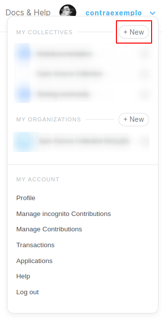
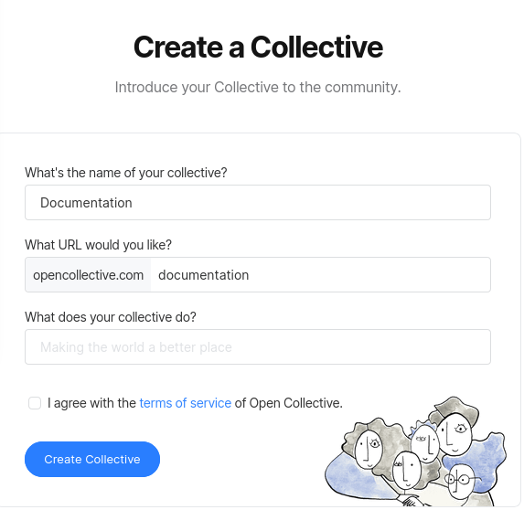
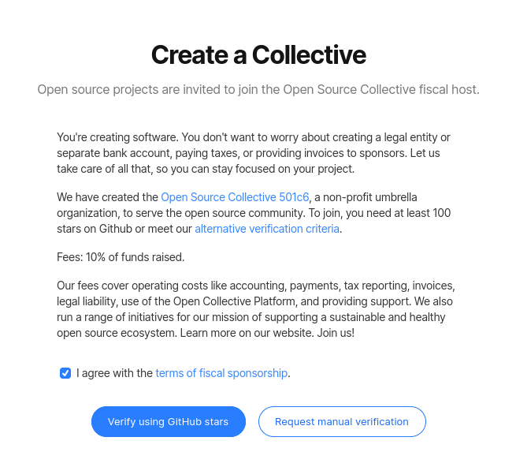
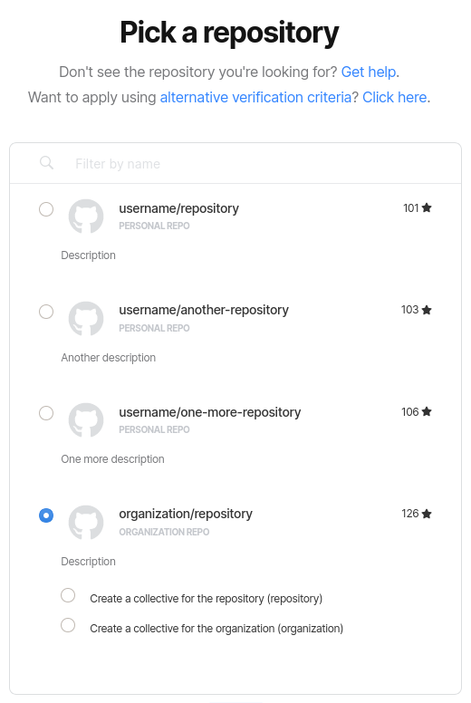

# Creating a Collective

Open Collective allows you to create a transparent funding page for your project in just a few clicks. No need to incorporate, hire a lawyer and accountant, or define organizational roles!

First, reveal the dropdown menu by clicking on your username.click on the **+ New** button under the **My Collectives** section.

Then, select the category that best describe your Collective.

If you are creating a Collective for communities of any kind or climate initiatives, you will be immediately directed to a Collective creation form, where you will be asked for your **Collective name**, **URL slug** of choice, and a **brief description** of your Collective's activities. 

But if you are creating a Collective for an **open source project**, you will have to go through a verification process to join Open Source Collective fiscal host before filling that form.

### Open Source Collective verification

We offer two verification methods: **verification using GitHub stars** and **manual verification**.

#### Using GitHub stars


You need to connect your GitHub account to your Open Collective account to be able to pick a repository.


Select the GitHub repository you would like to use in your application. If you select an organization repository, you will be given the option to either create a Collective for the repository, or a Collective for the organization itself.

#### Manual verification request

If you project don't meet that criteria, click on **Request manual verification**—your request will be reviewed using an [alternative verification criteria](https://www.oscollective.org/#criteria).

