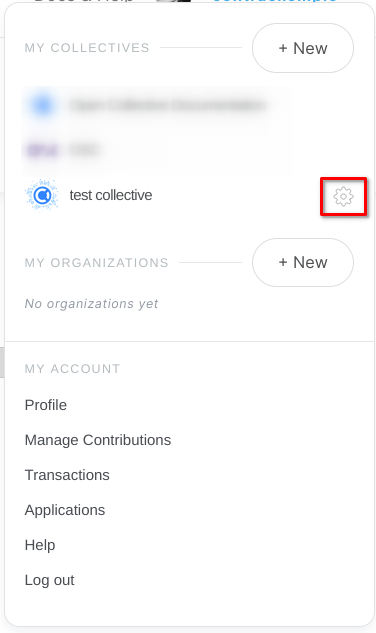

# Data Export

To see the data export options, reveal the dropdown menu by clicking on your username and click on the gear icon next to the name of your Collective.


The gear icon will only appear if you are a Collective admin.


On the settings page, go to **Export**.

On this page, you can export your data into:

* Widgets
* Badges
* Contributors images
* CSV files
* JSON files

## Widget

Export an HTML script to use on your website, showing your financial contributors.

## Export images

### Badge

Create an SVG showing the number of financial contributors of your Collective. By updating the text in the URL, you can change the label and color.

Code:

`https://opencollective.com/collective/tiers/backers/badge.svg?label=Backers&color=brightgreen`

Result:

### Contributor image

Create an SVG showing the icons of your financial contributors.

There are a range of options:

| Parameter | Description | default |
| :--- | :--- | :--- |
| width | width of the image |  |
| height | height of the image |  |
| limit | max number of members to show | \(unlimited\) |
| avatarHeight | max height of each avatar / logo |  |
| button | show "become a backer/sponsor" button | true |
| format | format of the image \(replace .svg with .png or .jpg\) |  |

Code:

`<object type="image/svg+xml" data="https://opencollective.com/collective/tiers/backers.svg?avatarHeight=36&width=600"></object>`

Result:

## Export CSV

Download a file of all contributors, with these fields:

* MemberId
* createdAt
* type
* role
* tier
* isActive
* totalAmountDonated
* currency
* lastTransactionAt
* lastTransactionAmount
* profile
* name
* company
* description
* image
* email
* twitter
* github
* website

## Export JSON

Export your data to integrate with other applications.

Options:

* All members \(contributors of all types\)
* Only users \(individuals\)
* Only organizations

Parameters:

* limit: number of members to return
* offset: number of members to skip \(for paging\)
* TierId: only return the members that belong to this TierId. You can find the TierId as part of the URL after selecting a tier on your collective page

