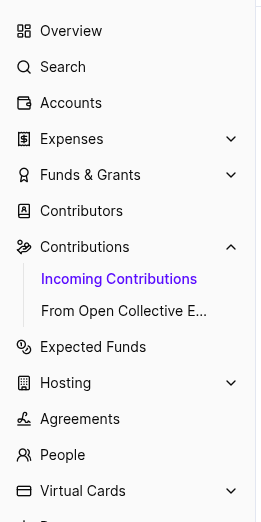

# Expense Comments

Comments on expenses are the best way to add information, check the status, or ask questions. If you comment on an expense, the submitter, core contributor, and fiscal host admin will be notified.

Common uses for expense comments:

* Clarifying or adding details about the expense, to help others understand why it's legitimate or what it was for
* Requesting missing documentation \(like a receipt or tax form\)
* Following up if an expense has not been paid for a while
* Thanking the submitter for the work they did

