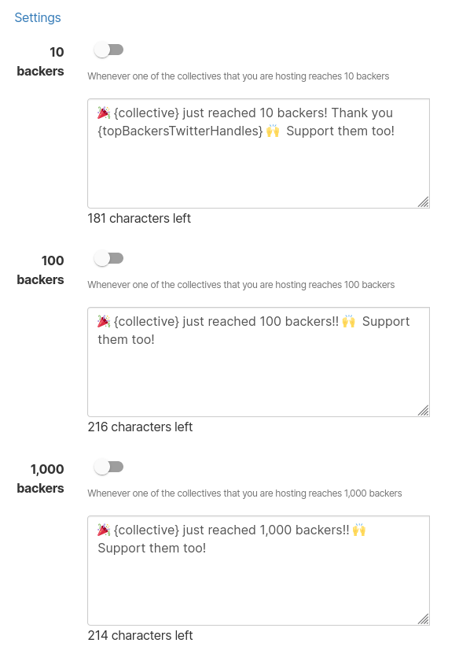
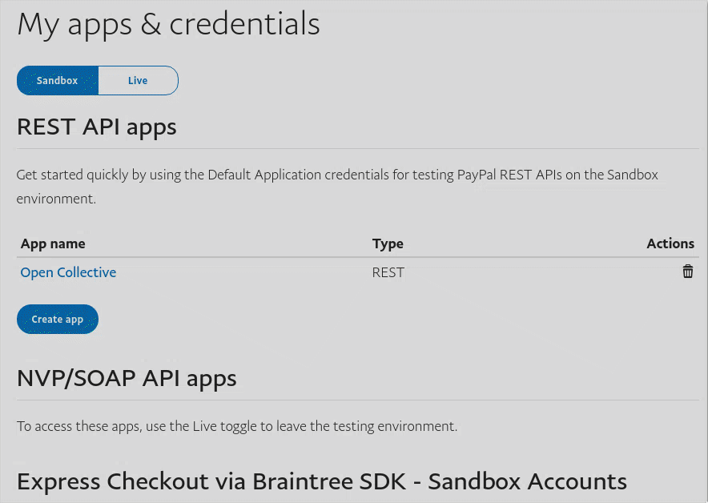

# Connect external accounts

## Connecting a Twitter account

Click on **Connect Twitter**. You will be prompted to either directly authorize Open Collective to access your account or to log in and authorize it.

Connecting your account will provide you a few automation options based on how many financial contributors Collectives you host have reached:

## Receiving donations through PayPal


This feature is currently in **Beta** test, read more about it below.


### The Beta test

We're currently testing this feature with the help of selected Host collectives.

If you're interested in testing this feature, please reach out through [https://opencollective.com/support](https://opencollective.com/support). If you're already testing the feature and wish to leave the test, you can also send an email to support.

### Fees

#### What are the fees involved?

There are payment processor fees charged by PayPal and if you're subjected to, the platform fees charged by Open Collective.

The payment processor fees will be automatically deducted from the original charge but as of now, the platform fees can not be automatically deducted. For the current beta, this debt will be settled once a month through an invoice we'll send you.

### Connecting PayPal

If you're already in the beta test group, you can follow these instructions:

1. [ ] Create a new PayPal app

   * Open [PayPal's Developer](https://developer.paypal.com/developer/applications/) page and Log In.
   * In _My Apps & Credentials_ page, select the **Live** environment, and click in _Create app_.

   

   * Name this App after Open Collective, this way you'll always remember where this token is being used.
   * Click _Create App._

* [ ] Now, copy the necessary information to Open Collective.
  * Open a new tab and go to [Open Collective](https://www.opencollective.com).
  * Open your Host collective settings page and click in the _Receiving Money_ option in the menu.
  * Copy and paste _Client ID, Secret_ in the respective fields, leave Webhook ID empty.
  * Click _Connect PayPal._

