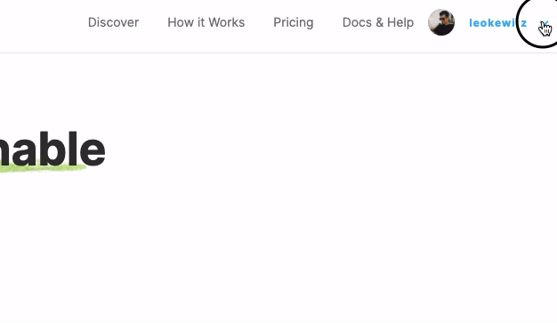

# Payouts with Wise

For hosts that are using Wise, this integration can be used to automate expense payment by providing a one-click solution for paying expenses.

After connecting your Wise account, users submitting new expenses will have access to a structured form for providing a valid bank account information and you will be able to pay those expenses automatically with the _Pay with Wise_ button.

## Fees

### What are the fees involved?

The fees are charged by Wise and its value will vary with the currencies and value being transferred. You can read more about [Wise fees here](https://transferwise.com/help/13/understanding-fees-and-rates/2522717/how-do-you-determine-your-fees).

### Who pays these fees?

These fees are paid by the collective the expense was submitted for. This means that transactions in Wise will display the fees but that value will also be deducted from the collective balance in our platform as a _payment processor fee_.

## Limitations

* Payments through Wise require a borderless account.
* Payments should respect the fund amount you have accounted for in the platform.
  * You can't pay expenses if the budget accounted for the collective is not enough to cover the transfer expenses.
* The host is still responsible for managing funds in Wise.
  * Transfers are funded with your host currency.
    * If your host is using USD, we're funding all your transfers with your USD balance despite the payee currency.

## Connecting Wise

* Go to [Open Collective](https://www.opencollective.com).
* Open your Host collective settings page and click on the _Sending Money_ option in the menu.    
* Click on _Connect Wise_ button;

* Now, log in with your business's Owner account and, if requested, select your business profile;
* Click on the _Give Access_ button:

* Done! Now all your hosted collectives will be able to submit Bank Transfer expenses compatible with TransferWise and you'll be able to pay for it with one click.
  * Notice that this option will only be available for new expenses. Expenses created before Wise support was added are not structured as required by Wise and will need to be edited or recreated by the payee.

## Reducing Risks

In order to reduce risks related to having an active API token that is able to create and fund transactions, we strongly suggest you to:

1. Activate the Two-Step Authentication in Wise.
2. Keep just enough balance in Wise to pay your expenses.
   * This can be achieved by calculating the amount needed for the current payment cycle and transferring it beforehand.

## Troubleshooting

* `Unable to fund transfer`
  * Double-check if you have enough funds in your Wise balance, you'll be using the balance with the same currency of your OpenCollective account.

